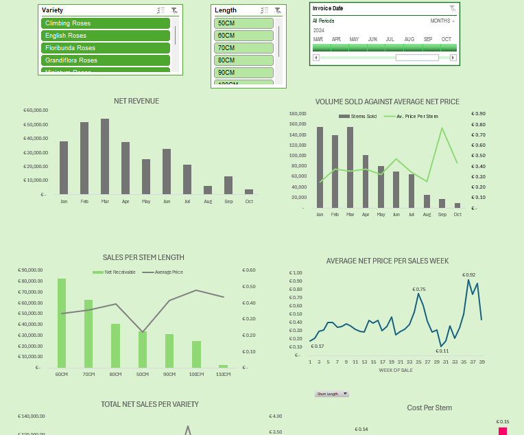

# Roses-Auction-Sales-Analysis
## Description
This project provides an analysis of roses sold through auctions in 2024. It uses Excel to build a dynamic dashboard and create summaries of auction sales performance, shipment data, and cost breakdowns.

The dashboard tracks the performance of roses by variety, stem length, and shipment charges, offering valuable insights for stakeholders in the floral auction industry.

---

## Files

- **`Dashboard`**: The main dashboard visualizing key sales metrics such as auction performance over time, freight costs by variety, and product length comparisons.
- **`DATA`**: The raw dataset, containing auction records such as shipment weeks, flower varieties, weights, and auction sales.
- **`PIVOTS`**: Pivot tables that summarize data on net sales per month, weekly auction performance, freight charges per variety, and more.

---

## Key Features
- **📊 Dynamic Dashboard**:
  - Sales performance tracked across different rose varieties and lengths.
  - Shipment performance with an emphasis on **freight charges per variety**.
  - Weekly and monthly trends for auction sales.
  
- **📈 Pivot Table Summaries**:
  - **Net sales per month** and auction week analysis.
  - Average price and shipment weight performance by flower variety.
  - Freight cost summaries, highlighting the most cost-effective shipping options.

- **🔍 Data Insights**:
  - Comprehensive **freight cost analysis** based on variety.
  - Identification of **top-performing rose varieties** by sales.
  - Weekly auction performance across different varieties and stem lengths.

---

## Tools Used
- **Microsoft Excel**: 
  - For data analysis and dashboard creation.
  - Pivot tables for summarizing auction and shipment data.
  
---

## How to Use
1. Download and open the Excel file: **`ROSES SALES ANALYSIS 2024.xlsx`**.
2. Navigate to the **Dashboard** tab to view auction sales and shipment insights.
3. Explore the **DATA** tab for raw auction data.
4. Check out the **PIVOTS** tab for pivot table summaries on sales, shipment costs, and performance by variety.

---

## Screenshots

---

## Contact
For questions or further details, feel free to reach out!
